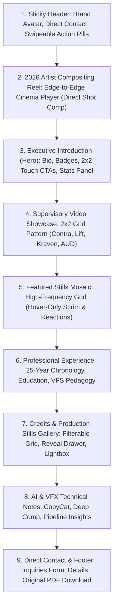

# Project Mission & Constitution: Dan Rubin VFX Portfolio

**Version:** 2.0.0  
**Status:** ACTIVE  
**Date:** October 2026  
**Methodology:** Spec-Driven Development (SDD)  
**Reference Benchmarks:** Minimalism & Tier-1 VFX Studios ([Image Engine](https://image-engine.com/), [Digital Domain](https://digitaldomain.com/), [Wētā FX](https://www.wetafx.co.nz/), [Eyeline Studios](https://eyelinestudios.com/en))

---

## 1. Executive Vision & Purpose

This project establishes the definitive online portfolio for **Dan Rubin**, an accomplished Visual Effects professional with **25+ years of experience** spanning Hollywood feature films, animated blockbusters, and episodic productions.

### Core Strategic Purpose: High-Impact Digital Business Card & Conversion Engine
The portfolio operates first as a frictionless, high-conversion digital business card. Recruiters, VFX supervisors, and directors can immediately verify Dan's identity, credentials, active reels, unaugmented CV, work authorization, and contact information without multi-page friction or menu navigation.

The site communicates Dan's dual industry leadership:
1. **Compositing Supervisor and Artist:** Hands-on sequence artistry and department leadership across large teams, creature look-dev, deep compositing pipelines, and studio delivery (*Contra el Huracán*, *Avatar: Fire and Ash*, *Lift*, *Kraven the Hunter*, *Spider-Man: Into the Spider-Verse*).
2. **Educator & Mentor:** Advanced instruction at Vancouver Film School (VFS) in Deep Compositing and AOV workflows, combined with tailored artist coaching and dailies critique.

---

## 2. Target Audience Hierarchy & Intent

The site architecture directly serves four distinct visitor personas:

| Priority & Persona | Core Intent & Evaluation Criteria | Key Portfolio Touchpoint |
| :--- | :--- | :--- |
| **1. VFX Recruiters & Talent Acquisition (Primary)** | Fast verification of availability, location (`Vancouver, BC`), citizenship (`Dual US & Canadian`), credits, and direct outreach. | **Sticky Header & Hero:** 1-tap contact buttons (Call, Email), unaugmented PDF Résumé modal, direct IMDb, LinkedIn, and password-protected Vimeo showcase. |
| **2. VFX Supervisors & Heads of Department** | Evaluates department leadership, sequence look-dev, bidding, crew scaling, and client delivery under pressure. | **Supervisory Breakdowns Grid (2×2):** 4-up 2×2 grid showcase featuring *Contra el Huracán*, *Lift*, *Kraven the Hunter*, and *American Underdog*. |
| **3. Industry Peers & Compositors** | Assesses photoreal plate integration, CG creature comp, deep compositing, stereo 3D, and custom Python tooling. | **2026 Artist Reel & Featured Stills Mosaic:** Edge-to-edge full-width Artist Reel, 16-shot high-frequency grid mosaic with hover-only technical scrim, single-vote emoji reactions, and theater Lightbox. |
| **4. Educators & Students** | Evaluates curriculum depth, technical pedagogy, and artist mentoring philosophy. | **Teaching & Mentorship Showcase:** Verbatim VFS instruction statement and artist coaching frameworks. |

---

## 3. Aesthetic Direction: Minimalism & Tier-1 Studio Benchmarks

The visual design is grounded in **Minimalism**—championing content-first restraint, generous negative space, and absolute clarity so photoreal VFX shots and career milestones dominate without visual distraction.

```
       ┌────────────────────────────────────────────────────────┐
       │                      MINIMALISM                        │
       │    Content-First Restraint • Generous Whitespace       │
       │   Zero Decorative Bloat • Purposeful Micro-Physics     │
       └───────────────────────────┬────────────────────────────┘
                                   │
         ┌─────────────────┬───────┴─────────┬──────────────────┐
         ▼                 ▼                 ▼                  ▼
   IMAGE ENGINE      DIGITAL DOMAIN       WĒTĀ FX        EYELINE STUDIOS
  Crisp White Canvas  Cinematic Authority  Grotesque Type  Precision Monospace
  Airy Negative Space Hairline Borders     Anamorphic 16:9  R&D Tool Callouts
  Clean Light Scrim   Ruby/Crimson Accent  Museum Stills   Tactile Pill Docks
```

### 3.1 The Tenets of Minimalism
- **Content-First Clarity:** Visual effects shots and verified credits are the sole hero; interface elements exist only to support and contextualize them.
- **Intentional Whitespace:** Generous vertical spacing (`padding: 80px 0` desktop, `44px 0` mobile) prevents cognitive fatigue and lets complex cinematic shots breathe.
- **Restrained Palette:** Crisp white canvas (`#ffffff`), subtle off-white structural cards (`#f8f9fa`, `#f1f3f5`), slate/charcoal typography (`#111827`, `#374151`), and a single surgical accent color (crimson `#b91c1c` / ruby) reserved for active states.
- **Zero Decorative Bloat:** No unnecessary borders, gaudy gradient meshes, auto-playing audio, or intrusive popups. Every button, border, and badge performs an explicit communicative function.
- **Compact Viewport Footprint:** Streamlined 2-row mobile header (~74px height) with swipeable pill tray, protecting 80%+ of the mobile screen for content.

### 3.2 Studio Benchmark Synthesis
- **Image Engine:** Clean pure-white canvas, subtle background shifts, and airy layout letting visuals stand forward.
- **Digital Domain:** Razor-clean hairline borders (`1px solid #e5e7eb`), high-contrast typography, and authoritative presentation.
- **Wētā FX:** Monumental geometric grotesque typography (`Avenir Next`, `Helvetica Neue`), letterbox aspect ratios (16:9 and 2.39:1), uppercase tracked metadata (`letter-spacing: 0.1em`), and museum-grade imagery.
- **Eyeline Studios:** Innovation-driven metadata badges (`Space Mono`), sleek rounded pill docks, and structured pipeline breakdown callouts.

---

## 4. Architectural Sequence Hierarchy (Flow of Page)

The site sequence enforces a logical narrative from immediate hands-on artistry to executive leadership, portfolio stills, and career history:



1. **Digital Business Card Header (`#site-header`):**
   - Left: Brand Avatar (`DR`), Dan Rubin, "Compositing Supervisor and Artist • Mentor & Educator".
   - Right: Recruiter contact chips (Desktop) and compact 1-tap call/email/CV triggers (Mobile).
   - Bottom Row: Swipeable single-row pill tray jumping directly to key sections. Zero middle navigation clutter.
2. **2026 Artist Compositing Reel (`#artist-reel`):**
   - Edge-to-edge full-width cinema player dedicated purely to direct shot compositing (creature integration, blue/green screen, deep comp, 2.5D projection). Free of supervisory management tasks.
3. **Executive Introduction & Hero (`#hero`):**
   - Concise biographical overview, citizenship and Emmy/Gemini credentials, responsive 2×2 touch action grid, and 25-year industry stats panel.
4. **Supervisory Video Showcase & Breakdowns (`#supervisory-reels`):**
   - Four flagship supervisory shows presented side-by-side in a **balanced 2×2 grid pattern** on desktop (*Contra el Huracán*, *Lift*, *Kraven the Hunter*, *American Underdog*). Minimalist show title and role/studio metadata below each 16:9 player, gracefully stacking to 1 column on mobile.
5. **Featured Stills Mosaic (`#featured-stills-carousel`):**
   - 16-frame **high-frequency grid mosaic** (4 columns desktop, 3 tablet, 2 mobile). Pure unmarred visual frames by default; technical metadata (title, role, studio) and single-vote emoji reactions appear **only when hovered or tapped**.
6. **Career Experience Timeline (`#experience`):**
   - Verbatim 25-year chronology matching original resume, alongside studio badges, VFS advanced teaching statement, awards, and technical notables.
7. **Credits & Production Stills Gallery (`#projects`):**
   - Filterable catalog (All, Supervised, Feature Films, Episodic, Deep Comp) with 16:9 verified stills, studio badges, click-to-reveal contribution drawers, and Lightbox triggers.
8. **AI & VFX Technical Notes (`#ai-notes`):**
   - Articles on Foundry Nuke CopyCat machine learning, deep compositing pipelines, and AI integration in high-end VFX, with searchable archive modal.
9. **Contact & Direct Inquiries (`#contact`):**
   - Interactive inquiry form with input validation (Safari auto-zoom protected at `16px`), direct contact information, and direct download of the original intact 3-page résumé PDF.

---

## 5. Interaction Model & Tactile Micro-Physics

To deliver engaging, responsive interactions without violating minimalism:

- **Single-Vote Emoji Reactions:** One vote per emoji type per still (❤️, 🔥, 👏, 🎬). Increments by exactly +1; repeated clicks trigger a gentle micro-shake indicating the vote is recorded. Persists locally via `localStorage`.
- **Spring Physics Micro-Bounce:** Buttons, pills, and filter chips feature organic spring easing (`translateY(-2px)` on hover, `scale(0.96)` on active press), returning smoothly on release.
- **Theater-Grade Lightbox Modal:** Fullscreen dark canvas (`z-index: 100000`), pinned top exit bar (<kbd>✕ BACK TO PORTFOLIO (ESC)</kbd>), keyboard arrow navigation, swipe gestures, and protective media shields.
- **Interactive Résumé Modal & Intact PDF Engine:** Embedded viewer displaying the exact unaugmented 3-page original PDF (`Dan_Rubin_Resume.pdf`) with 1-click download triggers across Hero, Experience, Contact, and Footer, alongside structured CV, Cover Letter, and Verbatim text tabs.

---

## 6. Architectural Invariants & Non-Goals

### 6.1 Strict Invariants
1. **Minimalist Aesthetic:** Clean, light canvas with generous whitespace and zero decorative bloat. Visual assets and verified credits remain the primary focus.
2. **Title Invariant:** Strictly **"Compositing Supervisor and Artist"** in all brand headers, hero sections, and resume titles. (Historical credits retain their specific accredited roles).
3. **Exact Sequence Mandate:** Header → Artist Reel → Intro (Hero) → Supervisory Breakdowns → Stills Carousel → Experience → Credits & Stills → AI Notes → Contact.
4. **Artist Reel Purity:** The Artist Compositing Reel highlights only direct hands-on compositing; supervisory management tasks remain in the Supervisory Showcase.
5. **Zero Master MP4 Download Buttons:** Master MP4 downloads are disabled to protect proprietary VFX studio media.
6. **Single-Vote Emoji Engine:** Strictly 1 vote per emoji type per still, contributing once (+1).
7. **Unaugmented Résumé Integrity & Intact PDF Downloads:** The downloadable resume PDF must never be augmented or re-generated from HTML. The original 3-page PDF (`Dan_Rubin_Resume.pdf`) formatting, layout, typography, and page count must be preserved 100% intact for download by recruiters.
8. **VFS Teaching Statement:** Preserves Dan Rubin's exact wording, bolding, and pedagogical intent.
9. **Zero Build Mandate:** 100% Vanilla HTML5, CSS3, and JavaScript. No Node.js build step, bundler, or runtime framework dependencies.
10. **Mobile Parity:** ~74px compact two-row header with swipeable pill tray, 2-column high-frequency stills mosaic with touch-reveal scrim, stacked 16:9 supervisory video cards, 16px form inputs to prevent iOS Safari auto-zoom, and touch swipe gestures.

### 6.2 Non-Goals
- **NO Dark-Only Theme:** Preserves the crisp, editorial light canvas inspired by Image Engine.
- **NO Heavy Frontend Frameworks:** No React, Next.js, Vue, or npm packages.
- **NO Redundant Navigation Clutter:** No middle navigation bars crowding header space.
- **NO Uncompressed Media:** All video assets encoded as H.264 MP4 with faststart flags.
- **NO Intrusive Overlays:** No floating docks occluding mobile screens or video controls.
