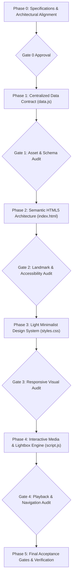

# Implementation Roadmap & Verification Plan: Dan Rubin VFX Portfolio

**Version:** 1.0.0  
**Status:** DRAFT (Under Review)  
**Date:** October 2, 2026  
**Methodology:** Spec-Driven Development (SDD)  

---

## 1. Roadmap Overview & Execution Strategy

This roadmap details the phased, step-by-step implementation of the Dan Rubin Visual Effects Portfolio. Under Spec-Driven Development (SDD), each phase is gated by explicit deliverables and verification criteria. No code proceeds to the next stage until the current gate is verified.

---

## 2. Phased Implementation Plan

### Phase 0: Specifications & Architectural Alignment (Current Phase)
- **Goal:** Establish foundational project requirements, layout flow, aesthetic direction, and technical invariants before writing code.
- **Key Deliverables:**
  - `specs/mission.md`: Mission statement, personas, section hierarchy, non-goals.
  - `specs/tech-stack.md`: Zero-bloat static architecture, design tokens, media pipeline.
  - `specs/roadmap.md`: Phased implementation and verification gates.
- **Exit Gate:** User reviews and approves the three specification documents.

---

### Phase 1: Centralized Data Contract & Asset Audit (`data.js`)
- **Goal:** Ensure 100% of data, text, and media paths are verified, structured, and decoupled from HTML.
- **Tasks:**
  1. Standardize `PORTFOLIO_DATA` schema:
     - `personal`: Name, title, subtitle (`Compositing Supervisor • Mentor & Educator`), email, phone, location, IMDb, LinkedIn, Vimeo (with `password` password).
     - `supervisoryShowcase`: *Contra el Huracán* (Eyeline VFX), *Lift* (Image Engine), *Kraven the Hunter* (Image Engine).
     - `artistReel`: 2026 Artist Compositing Reel (file: `videos/2026CompositingReel.mp4`, download name: `Dan_Rubin_2026_Artist_Reel.mp4`).
     - `teaching`: Verbatim VFS statement with `<strong>Deep Compositing and AOV workflows</strong>` and `<em>how</em>`.
     - `experience`: Verbatim chronology matching `original_resume.txt` without augmentation.
     - `stills`: Disk-verified stills array with correct film titles and roles.
  2. Verify all video files on disk are 1080p H.264 MP4 with faststart headers.
  3. Guarantee zero missing or phantom image paths.
  4. Structure a dedicated **⚡ QUICK UPDATE CONTROLS** block at the head of `data.js` to allow swapping the active reel or updating resume credits in under 60 seconds with zero build tools.
- **Exit Gate:** Automated asset validation script confirms `Missing assets: 0` and `Failed video codecs: 0`.

---

### Phase 2: Semantic HTML5 Architecture (`index.html`)
- **Goal:** Construct a clean, accessible HTML5 document outline reflecting Dan's exact section ordering and Image Engine structure, serving primarily as a Digital Business Card & High-Conversion Landing Page.
- **Tasks:**
  1. **Digital Business Card Header & Brand Identity:**
     - Left: "Dan Rubin" and "Compositing Supervisor • Mentor & Educator".
     - Direct contact info chips: Email (`danielrubin76@gmail.com`), Phone (`(604) 345-8636`), Location (`Vancouver, BC — Dual US & Canadian Citizen`).
     - Right: High-utility action pills: `[Supervisory Breakdowns]`, `[Artist Reel]`, `[Credits & Stills]`, `[Résumé]`, `[IMDb]`, `[LinkedIn]`, `[Vimeo pw: password]`, `[Contact]`.
     - Recruiter priority: Instant access to availability, work authorization, CV download, and reels above the fold.
     - Strictly remove middle anchor navigation.
  2. **Section 1 — Unified Studio Video Showcase & Supervisory Breakdowns:**
     - Single prominent widescreen 1080p player with 6 custom switcher tabs.
     - Front tabs for Supervisory Breakdowns (*Contra el Huracán*, *Lift*, *Kraven the Hunter*), followed by *2026 Artist Compositing Reel*, *American Underdog*, and *Princess Switch 3*.
     - Header jump links: `[Supervisory Breakdowns]` switches to Tab 1, and `[Artist Reel]` switches to Tab 4.
  3. **Section 2 — Career Experience Timeline & Featured Kinetic Carousel:**
     - 25-year career chronology cards matching unaugmented resume.
     - Top horizontal scrolling stills ribbon (hover to pause, rollover credits, click to expand).
     - Featured Kinetic Stills Carousel (~15–20 curated flagship shots): horizontal track slide with swipe inertia, auto-advance with hover-pause, floating side peek previews, borderless stills with hover/tap overlay, and zero thumbnail clutter.
  4. **Section 3 — Credits & Production Stills Gallery:**
     - Visual grid of career credits paired with verified production stills.
     - Each card displays: project title, release year, exact title credited (e.g. "Compositing Supervisor", "Lead Compositor"), studio/client, and production still.
     - Interactive click on any still opens the theater-grade Lightbox.
     - Category filter pills: All, Supervised Shows, Feature Films, Episodic, Deep Compositing & Stereo 3D.
  5. **Section 4 — Educator Experience & Mentorship Offer:**
     - Verbatim VFS teaching blockquote with highlighted Deep Compositing & AOV workflows.
     - Mentorship tiers: Junior-to-mid career transition, senior look-dev prep, and dailies/note interpretation.
     - Contact CTA for curriculum/mentorship inquiries.
  6. **Section 5 — Unaugmented Résumé & Inquiries:**
     - Verbatim CV modal with Print/Save PDF and Copy Text actions.
     - Clean, direct contact section and inquiry draft form.
     - Minimalist Floating Quick-Contact Pill docked at bottom-right of viewport (Phone, Email, LinkedIn).
  7. **Lightbox Modal Container:**
     - Fixed top exit bar `[✕ BACK TO PORTFOLIO (ESC)]` anchored to viewport top.
     - Floating `‹` and `›` navigation buttons, image frame, and backdrop handler.
- **Exit Gate:** HTML5 validation passes; landmark elements correctly nested.

---

### Phase 3: Light Minimalist Design System (`styles.css`)
- **Goal:** Implement the Image Engine-inspired clean light aesthetic with Arial Bold typography.
- **Tasks:**
  1. Establish light theme design tokens:
     - Pure white `#ffffff` canvas with subtle off-white `#f8f9fa` surface cards.
     - Jet-black typography `#111827` and slate borders `#e5e7eb`.
  2. Implement **Arial Bold** typographic hierarchy:
     - Font family: `Arial, "Helvetica Neue", Helvetica, sans-serif`.
     - Bold section titles, crisp uppercase metadata labels, and comfortable line heights.
  3. Style the clean top header with contact info and action pills.
  4. Style the video player container with clean dark player borders for high visual punch against the white canvas.
  5. Style the Credits & Production Stills cards (crisp white card frames, 16:9 cinematic stills, bold titles, and credited role chips).
  6. Style horizontal stills ribbon with smooth continuous scroll and hover-pause.
  7. Style tactile button bounce micro-interactions using custom cubic-bezier spring curves (`cubic-bezier(0.34, 1.56, 0.64, 1)`).
  8. Style emoji/heart reaction badges with pop micro-animations.
  9. Style interactive click-to-reveal contribution overlay/drawer on stills cards.
  10. Style Minimalist Floating Quick-Contact Pill (crisp white pill, subtle elevation, spring bounce, auto-hide on modal/lightbox open).
  11. Style Lightbox modal with high-contrast pinned top exit bar (`z-index: 100000`).
  12. Mobile, tablet, and desktop responsive rules (<768px, 768–1024px, >1024px).
- **Exit Gate:** Visual inspection confirms light minimalist aesthetic matching https://image-engine.com/ with tactile button bounce and flawless typography.

---

### Phase 4: Interactive Media, Gamification & Lightbox Engine (`script.js`)
- **Goal:** Wire up video switcher, gamified reactions, touch swiping, click-to-reveal contributions, unaugmented resume modal, and theater-grade Lightbox.
- **Tasks:**
  1. Video Switcher: Seamless switching between 6 1080p MP4s with instant metadata updates and autoplay policy handling.
  2. Credits & Stills Filter Engine: Instant category filtering (All, Supervised, Feature, Episodic, Deep) with smooth card transitions.
  3. Gamified Reactions Engine:
     - Emoji/heart reactions (❤️, 🔥, 👏) on stills with local persistence via `localStorage`.
     - Real-time increment and bounce animation on click.
  4. Touch & Mouse Swipe Gesture Engine:
     - Touch swipe detection (left/right) on top ribbon, slideshow, and Lightbox.
     - Smooth drag-to-scrub with cursor feedback on desktop.
  5. Click-to-Reveal Contribution Engine:
     - Toggle film title and Dan's specific technical/artistic contribution on click.
  6. Production Stills Ribbon: Fisher-Yates array shuffle on every page load; smooth loop; pause on hover.
  7. Production Stills Slideshow: Auto-advance with hover pause, synchronized thumbnail active states, and live slide counter.
  8. Theater-Grade Lightbox:
     - Pinned top exit bar always visible above image frame.
     - High-contrast `[✕ BACK TO PORTFOLIO (ESC)]` button.
     - Keyboard navigation: <kbd>ESC</kbd> to close, <kbd>←</kbd> and <kbd>→</kbd> to cycle stills.
     - Touch swiping between stills inside Lightbox.
     - Backdrop click close handler.
     - Support opening from ribbon, slideshow, and credits cards.
  9. Résumé Engine: Tab switching between CV, Cover Letter, and Verbatim Raw text with print styling.
- **Exit Gate:** Zero console errors; all interactions, gestures, and reactions functional across browsers.

---

### Phase 5: Final Acceptance Gates & Verification
- **Goal:** Rigorous end-to-end verification against the master Acceptance Criteria.
- **Verification Gates:**
  - [ ] **Gate 1 (Digital Business Card & Recruiter Landing Header):** Serves as an immediate digital business card: displays "Dan Rubin", "Compositing Supervisor and Artist" / "Compositing Supervisor • Mentor & Educator", contact info chips (Email, Phone, Vancouver BC Dual US/Canadian Citizen), and high-utility action pills (Supervisory Breakdowns, Artist Reel, Credits, Resume, IMDb, LinkedIn, Vimeo with password chip). Dual title strictly uses "Compositing Supervisor and Artist" (never "Compositing Supervisor and Senior Compositor"). No middle navigation menu.
  - [ ] **Gate 2 (Unified Video Showcase & Tab 1 Autoplay):** The unified studio player loads *Contra el Huracán* as Tab 1 and autoplays smoothly on mute, displaying the dynamic storm wave VFX still, 1080p trailer playback, and YouTube link.
  - [ ] **Gate 3 (Artist Reel & Video Switcher):** All 6 switcher tabs (*Contra el Huracán*, *Lift*, *Kraven*, *2026 Artist Compositing Reel*, *American Underdog*, *Princess Switch 3*) switch cleanly with instant metadata updates and zero playback stalls. Tab 4 correctly plays the *2026 Artist Compositing Reel*.
  - [ ] **Gate 4 (Credits & Stills Section):** Dedicated credits catalog displays project title, release year, exact title credited, studio, and verified production still, with working filter pills and Lightbox integration.
  - [ ] **Gate 5 (Gamified Interactions):** Emoji/heart reaction chips persist locally, buttons feature a subtle spring bounce, touch/mouse swiping cycles stills, and clicking a still reveals film title and Dan's specific contribution.
  - [ ] **Gate 6 (Stills Ribbon & Featured Kinetic Carousel):** Top ribbon is horizontal, randomized, scrolls smoothly, zero broken images. Kinetic Carousel features ~15–20 curated flagship shots with smooth side-to-side track slide, 5s auto-advance with hover pause, floating side peek previews, borderless stills with hover/tap overlay, and touch/drag swiping.
  - [ ] **Gate 7 (Lightbox Usability):** Expanding still reveals pinned `[✕ BACK TO PORTFOLIO (ESC)]` top bar. <kbd>ESC</kbd> exits. Backdrop click exits. Arrow keys navigate stills.
  - [ ] **Gate 8 (Minimalist Floating Quick-Contact Pill):** Pill docked at bottom corner gives instant phone, email, and LinkedIn triggers, auto-hiding during modal/lightbox view.
  - [ ] **Gate 9 (VFS Teaching Description):** Verbatim instruction text matching the user's provided statement with bolding and italics.
  - [ ] **Gate 10 (Unaugmented Résumé & Document Header):** Résumé matches `original_resume.txt` verbatim with zero modifications, and document header displays "Compositing Supervisor and Artist".
  - [ ] **Gate 11 (Aesthetic Alignment):** Light minimalist design system with Arial Bold typography matching the Image Engine benchmark.
  - [ ] **Gate 12 (Zero-Friction Maintenance):** Swapping the active reel or updating the resume requires only changing the `⚡ QUICK UPDATE CONTROLS` block in `data.js`, updating the entire site immediately without touching HTML or CSS.
- **Exit Gate:** All 12 gates verified and signed off.
